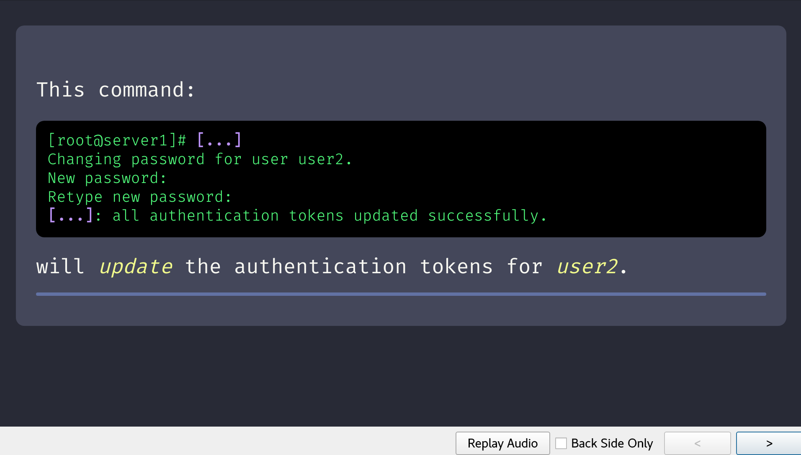

# Dracula for Anki (https://apps.ankiweb.net/)

> A dark theme for Anki (https://apps.ankiweb.net/).

## Install

All instructions can be found at [draculatheme.com/x](https://draculatheme.com/x).

## Team

This theme is maintained by the following person(s) and a bunch of [awesome contributors](https://github.com/dracula/template/graphs/contributors).

 |
--- |
[Dustin Dewett](https://github.com/ddewett) |

## License

[MIT License](./LICENSE)
